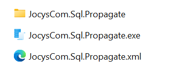
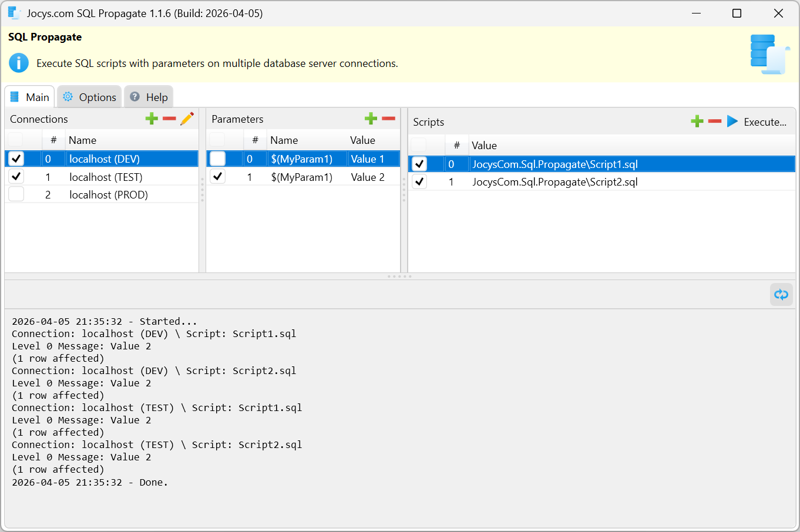

# Jocys.com SQL Propagate

Execute SQL scripts with parameters on multiple database server connections. Tool is customisable and can be tailored to specific tasks. You can change title header, body and initial log panel text to provide help and instructions. 

# Download

Digitally Signed Application v1.1.6.0 (2026-04-05)

[Download - JocysCom.Sql.Propagate.zip](https://github.com/JocysCom/SqlPropagate/releases/download/1.1.6/JocysCom.Sql.Propagate.zip)

## Screenshots

### Files

Program settings are automatically created with the same name as executable, but with \*.xml extension.



### Main Program

You can edit order (#) of execution, choose connections, parameters and scripts to use by simply checking or unchecking items.
Execution of 2 scripts with 1 parameter on 2 connections:



Note: Messages can be reported to the log panel by raising warnings:

```SQL
-- Demo: Read SQL Server version details and echo a custom message.
-- Parameter: $(MyParam1) - custom message to echo back.
-- This script is read-only and safe to run on any server.

-- Echo custom message.
DECLARE @msg nvarchar(256) = '$(MyParam1)'
RAISERROR(@msg, -1, -1) WITH NOWAIT
GO

-- Server version
SELECT
    SERVERPROPERTY('ProductVersion')     AS [ProductVersion],
    SERVERPROPERTY('ProductLevel')       AS [ProductLevel],
    SERVERPROPERTY('Collation')          AS [ServerCollation],
    @@VERSION                            AS [FullVersion],
    @@LANGUAGE                           AS [Language]
```
