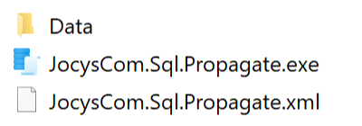

# Jocys.com SQL Propagate

Allows quick execution of multiple SQL scripts with paramters on multiple SQL servers.

## Screenshots

### Files

Program settings are automatically created with the same name as executable, but with \*.xml extension.

### Main Program

